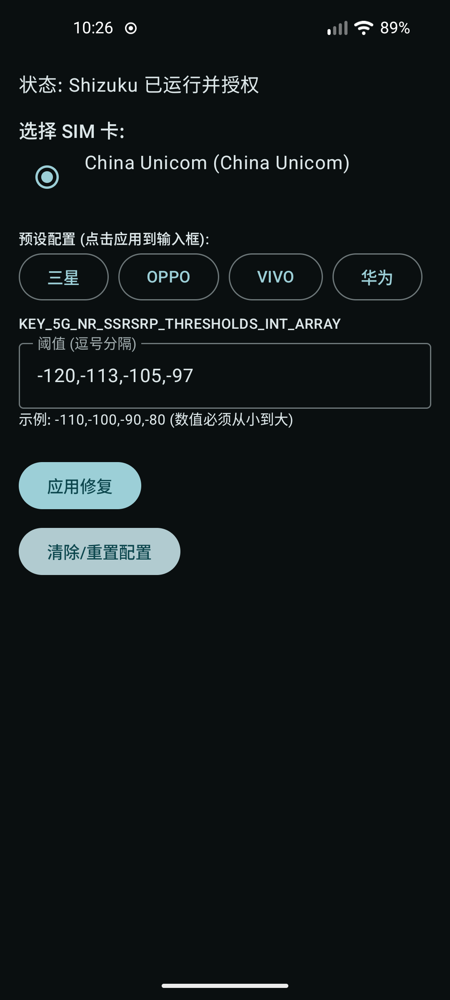

# SignalFix - Android 5G Signal Threshold Modifier

## 简介 Overview
SignalFix 是一个用于修改 Android 设备 5G 信号显示阈值 (SSRSRP) 的小工具。
它可以帮助解决某些运营商或设备在 5G 网络下信号格数显示不准确的问题（例如信号很强但只有 2 格）。

**核心原理**：利用 Android CarrierConfig 的 `overrideConfig` 机制，通过 Shizuku 授权，免 Root 修改系统层面的信号阈值配置。

## 功能特性 Features
*   **免 Root 修改**：依赖 Shizuku 运行，无需 Root 权限（需通过 adb 激活 Shizuku）。
*   **预设配置**：内置主流厂商（三星、OPPO、VIVO、华为）的推荐阈值，一键应用。
*   **自定义阈值**：支持手动输入 4 个等级的信号阈值（单位 dBm）。
*   **多卡支持**：自动读取双卡信息，支持分别对不同 SIM 卡应用配置。
*   **持久化生效**：修改写入系统 CarrierConfig，重启后依然有效。

## 使用说明 Usage

### 1. 准备工作
*   安装 [Shizuku](https://shizuku.rikka.app/) 并通过 adb 激活。
*   安装并打开 SignalFix。
*   在 SignalFix 中授予 Shizuku 权限。

### 2. 应用配置
*   选择需要修改的 SIM 卡。
*   点击上方的厂商按钮（如“三星”、“华为”）快速填入推荐阈值，或者在输入框中手动输入。
*   点击 **“应用修复”** 按钮。
*   观察状态栏信号格数变化（通常即时生效，有时可能需要切换飞行模式）。

### 3. 恢复默认 (重要)
如果你想恢复系统的默认信号显示策略，或者因更换 SIM 卡需要重置：
*   点击底部的 **“清除/重置配置”** 按钮。
*   **原理**：此操作会向系统发送一个空的配置包 (`null`)，触发 Android 系统清除当前 SIM 卡的所有 CarrierConfig 覆盖层，从而回退到系统或 SIM 卡原本的默认设置。

## 效果截图 Screenshots

| 使用前 | 使用后 |
|:---:|:---:|
|  |  |

## 常见问题 FAQ

**Q: 卸载 App 后配置还在吗？**
A: **在。**
修改是写入到系统的 CarrierConfig 存储中的，且标记为 `persistent=true`，因此卸载 App 后配置**依然生效**。
**建议**：保留 App 以便将来需要恢复默认设置或调整参数。如果卸载了，你需要重新安装本 App 才能执行“清除配置”操作。

**Q: 需要 Root 吗？**
A: 不需要，但必须激活 Shizuku。
